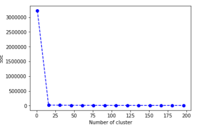
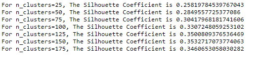

# JobFitt

### Our Team:

* Aiyanna Liz Mathew	
* Anu Khandelwal 
* Aruna Amaresan	
* Aswathy Mohan
* Pallavi Donwad

### Overview
Team Athena is looking to build a job fit recommender to indicate top highly likely position titles with mapping salary that would fit a given job seeker’s current skills, education, education level, years of experience and other factors. 

### Business Problem
With the changing technology trends with automation, analytics, cloud computing and machine learning becoming more popular, it is challenging currently for a fresh graduate or an experienced job seeker to understand the kinds of titles and salaries that would actually map to their current skills. They end-up feeding the same info to multiple sites and apply on different sites. 

It would help:
*   The job seeker to understand the value of their skills more and target their job application process. 
*   Check out Current trends within US 
*   Get access to data

Eventually, this would help the entire recruiting ecosystem that includes company career sites, job boards, applicant tracking systems, and staffing agencies to improve site engagement and candidate conversion.

### Goal 
The goal is to provide an app where a user would input info on skills, major, college (last attended), education level. These would form the independent X variables. Give this info, we would provide highly likelihood of title and salaries that map the user’s skills. This would be the dependent Y variables.

To do this, the plan would be to train a model using random forest algorithm and/or clustering with datasets found and/or using API calls to provide highly likelihood of title and salaries that map the user’s skills. 

### Method to our Madness!
*   Our goal is to first tackle sharing likely recommendation of title based on skills returned by user
*   Steps 1: Predict a group of highly likely job titles based on users skills based on survey result - We use predict using KMeans Clustering neural network. 
*   Step 2: We use our proprietery scoring  alogrithm to score user's level of education and experience again a preprocessed dataset from ONET with various education  and experinece level combiantion with weightage. 
*   Step 3: Sort and Order title by highest score for user's education level and experience level 
*   Step 4: Pull additiomal info like job description, technology skills, core tasks expected and alternative titles
*   Step 5: Merge and Pull sorted data. 
*   Step 6: Convert to dict and render in results page 
*   Step 7: More logic to share the results and findings using D3, plotly and Chloropleth

### Tools and Technologies used: 
*   Machine learning using KMeans, Random forest algorithm and Deep Machine learning using sklearn and pickle
*   MongoDB for backend database
*   Python, Pandas, json, ast, Flask, PyMongo for hosting app, routing endpoints and connecting with Mongo DB backend 
*   JQuery AJAX to pass user input from client side to server side and get server response
*   For Front-end – Powered with Bootstrap , CSS and visualization using plotly, chloropleth, D3 and SVG.

### Dataset links and other links:
The main datasets used: 
*   https://www.onetcenter.org/research.html?c=KSA (ONET - Valid, Reliable and Current. Nation's primary source for occupation information)
*   https://www.onetcenter.org/db_releases.html
*   https://www.bls.gov
*   https://www.glassdoor.com/research/data-sets/

### Our Takeaways
1. Trends show that the Jobs are growing and we are looking to see more of robotics and automation replacing the secretary and admin jobs

2. There is difference in job growth in numbers vs salary growth in those careers 

3. Certian skills and jobs seem to indicate job patterns (geographically) where they seem to be spread 

### KMeans Clustering

   Determining the **optimal number of clusters** in a data set is a fundamental issue in partitioning clustering, such as k-means clustering which requires the user to specify the number of clusters k to be generated. We used two approaches.

   #### Elbow Method

   1. The Elbow method looks at the total WSS[within-cluster sum of square ] as a function of the number of clusters

   2. One should choose a number of clusters so that adding another cluster doesn’t improve much better the total WSS. 

   3. The total WSS measures the compactness of the clustering and we want it to be as small as possible.

      

   ​

   #### Average silhouette method

      1. Average silhouette method measures the quality of a clustering.
      2. A high average silhouette width indicates a good clustering.

   

### Why predict and scoring algorithm ?(Why not ML)

1. Deep Learning : Accuracy(18%)
2. Random Forest: Accuracy(75%)

### Next Steps!

*   Gather enough datasets to replace second step of our proprietery alogirthm with a Neural Network machine learning model like RandomForest and DML .
*   For Current Trends - Do web scraping from other website to get news and show on trends page .
*   Provide Search functionality .
*   Include a functionality to upload the Resume in pdf format and do NLP to retrieve skills for predicting best jobs.

### Roadmap
*   App would suggest positions available right now in careers websites that map the title and salaries that were suggested 
*   Find what skill gaps to be updated to achieve the job position needs for a job seeker. 

